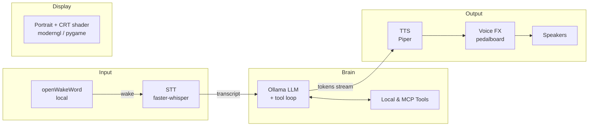

# Mr. House 🃏

<!-- Replace OWNER/REPO with your GitHub path to activate the badge. -->
[](https://github.com/radholm/mr-house/actions/workflows/ci.yml)

A low-latency, **local-first** voice assistant inspired by *Mr. House*. Say the wake
word ("Mr. House" / "House"), ask a question, and he answers back in a custom,
effected voice — while a single static portrait glitches and flickers behind a
CRT scanline shader.
<p>
    
    </br>
    <em>Mr. House?</em>
</p>
<p>
    
    </br>
    <em>...and the corresponding prompts to above image</em>
</p>

## System design



## Features

- 🎙️ **Wake word** — `openWakeWord`, runs fully offline. Configurable models.
- ⚡ **Low latency** — LLM output is streamed and synthesized sentence-by-sentence
  so Mr. House starts speaking before he's finished thinking.
- 🧠 **Local models** — LLM via [Ollama](https://ollama.com), STT via
  `faster-whisper`, TTS via `Piper`. No cloud required.
- 🗣️ **Thinking fillers** — if the first token is slow, he mutters *"Let me
  consult the data streams..."* so there is never dead air.
- 🛠️ **MCP tools** — connects to any [Model Context Protocol](https://modelcontextprotocol.io)
  servers (weather, web fetch, etc.) and lets the model call them.
- 🎭 **Personality + history** — a defined persona and rolling conversation memory.
- 📺 **CRT display** — a single image with scanlines, chromatic aberration,
  flicker and random glitch bursts via a GLSL fragment shader.
- 🎚️ **Voice FX** — reverb, EQ, high/low-pass filters and distortion via
  Spotify's `pedalboard`.

## Available tools

Mr. House can call tools during a conversation to fetch real information. Tools
are invoked automatically by the LLM when relevant.

### Built-in (local) tools

| Tool | Description |
|------|-------------|
| `web_search` | Look up factual information via Wikipedia (people, places, history, definitions). |
| `get_weather` | Current conditions or multi-day forecast for any location (Open-Meteo, no API key). |
| `get_time` | Returns the current local date and time. |
| `get_self_info` | Authoritative facts about Mr. House's identity, history, and goals. |
| `fallout_lore` | Look up Fallout / New Vegas lore from the Fallout wiki. |
| `control_lights` | Control smart-home lights/scenes via macOS Shortcuts or webhooks (requires `home` config). |

### MCP (Model Context Protocol) tools

Any [MCP](https://modelcontextprotocol.io)-compatible server can be added under
`mcp_servers` in `config.yaml`. Mr. House will discover the server's tools at
startup and make them available to the LLM alongside the built-in ones.

## Quick start

> Easiest path: run `./scripts/setup.sh` (macOS/Linux) or
> `powershell -ExecutionPolicy Bypass -File scripts\setup.ps1` (Windows). It
> picks a Python 3.10+ interpreter, installs system + Python deps, downloads a
> Piper voice and the openWakeWord models, and pulls the Ollama model. Then skip
> to step 4.

### 1. System dependencies

Requires **Python 3.10+** (3.9 is too old for several deps).

**macOS**
```bash
brew install python@3.13 portaudio uv   # uv provides uvx for MCP servers
brew install --cask ollama-app          # the official app (the 'ollama' formula
                                        # has shipped without the llama-server runner)
ollama serve &                          # start the local LLM server
ollama pull llama3.2:3b                  # a small, fast, tool-capable model
```

**Windows** (PowerShell)
```powershell
winget install Python.Python.3.13 astral-sh.uv Ollama.Ollama
# PortAudio ships inside the sounddevice wheel — nothing extra to install.
# Ollama runs in the background automatically after install.
ollama pull llama3.2:3b
```

### 2. Python environment

**macOS / Linux**
```bash
python3.13 -m venv .venv
source .venv/bin/activate
pip install -r requirements.txt
```

**Windows** (PowerShell)
```powershell
py -3.13 -m venv .venv
.\.venv\Scripts\Activate.ps1
pip install -r requirements.txt
```

### 3. Models / assets

- **TTS voice**: download a Piper voice (`.onnx` + `.onnx.json`) into
  `src/mr_house/assets/voices/` and point `config.yaml` at it. Grab one from
  <https://github.com/rhasspy/piper/blob/master/VOICES.md>, or **train your own
  custom voice** from a recording — see [`docs/TRAINING.md`](docs/TRAINING.md).
- **Portrait**: drop your image at `src/mr_house/assets/house.png` (or change the
  path in `config.yaml`).

### 4. Run

```bash
python run.py
```

## Configuration

Everything is in [`config.yaml`](./config.yaml): wake words, model names,
audio devices, voice-FX chain, shader parameters and the MCP servers to launch.

## Project layout

```
src/mr_house/
  config.py          # typed config loader
  app.py             # the orchestrator / state machine
  audio/
    capture.py       # mic streaming
    wake_word.py     # openWakeWord
    vad.py           # end-of-utterance detection
    stt.py           # faster-whisper
    tts.py           # Piper synthesis
    effects.py       # pedalboard voice FX
    player.py        # threaded playback queue
  brain/
    llm.py           # Ollama streaming + tool loop
    personality.py   # persona / system prompt
    fillers.py       # "thinking" lines
    memory.py        # rolling conversation history
    mcp_tools.py     # MCP client manager
  display/
    window.py        # moderngl/pygame window + shader
    shaders/crt.frag # the CRT/glitch fragment shader
```

## Notes

The code is written to **degrade gracefully**: if a model or library is missing,
that subsystem logs a warning and is stubbed, so you can develop one piece at a
time. Check `python run.py --check` to see which subsystems are available.

## Troubleshooting

- **He talks over himself / answers several times** — you probably have more than
  one instance running (e.g. an earlier run that didn't exit). A live run now
  takes a **single-instance lock** and refuses to start a second copy. To clear
  stragglers: `pkill -f run.py` (macOS/Linux) or `taskkill /F /IM python.exe`
  (Windows, or just use Task Manager).
- **Wake word won't trigger** — run `python run.py --mic-test` to see your live
  mic level + wake score, and lower `wake_word.threshold` in `config.yaml` to
  taste. On macOS, make sure your terminal/IDE has Microphone permission; on
  Windows, allow microphone access under Settings > Privacy & security >
  Microphone.
- **Can't exit** — press `ESC` / close the window, or `Ctrl+C` in the terminal
  (a second `Ctrl+C` force-quits). Note: processes started in the background with
  `&` have `SIGINT` ignored by the shell — use `pkill -f run.py` for those.
- **Wrong mic/speaker** — `python run.py --list-devices`, then set
  `audio.input_device` / `audio.output_device` in `config.yaml`.

